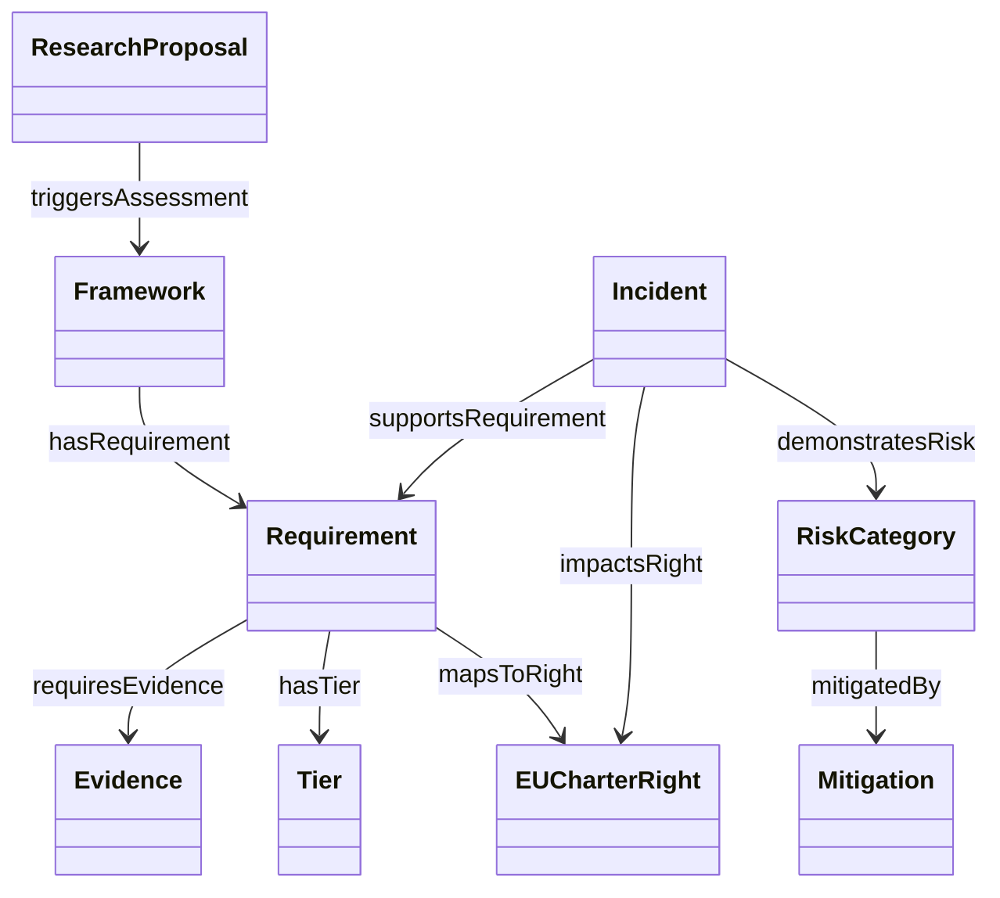
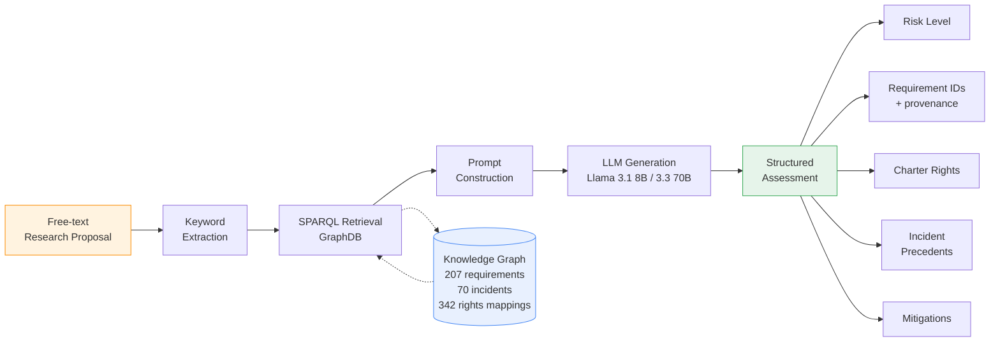
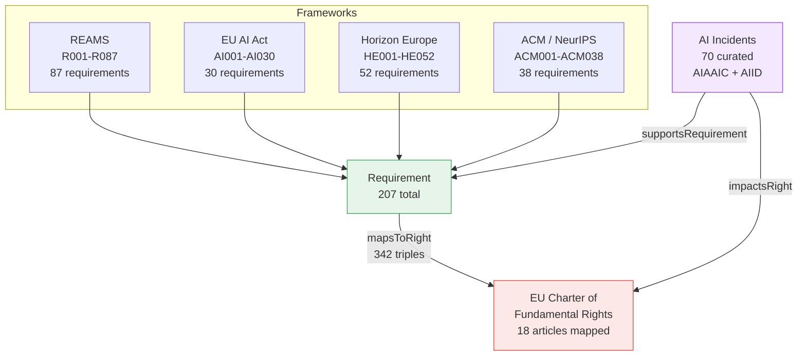
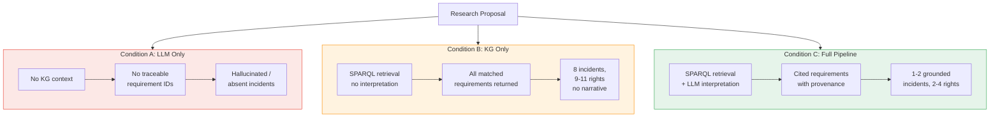
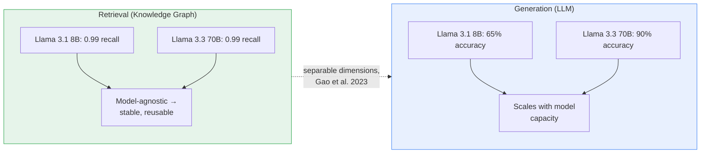

# Diagrams for the Trinity-format paper

Five diagrams below, as Mermaid code. For each:

1. Paste the code into https://mermaid.live
2. Export as PNG or SVG (Actions > download)
3. Save into this `diagrams/` folder using **exactly** the filename given (the .tex file already references these names)
4. Recompile `main.tex`

Diagram 1 (`concept-diagram.png`) recreates and extends your existing drawio ontology diagram —
same classes and relationships, redrawn in Mermaid so it's version-controllable and editable as text.
Diagrams 2–5 are new: system architecture, knowledge graph schema, evaluation/ablation methodology,
and the retrieval-vs-generation finding that's the paper's central result.

---

## 1. Ontology concept diagram — save as `concept-diagram.png`

## 2. System architecture — save as `architecture-flow.png`

## 3. Knowledge graph schema (framework harmonisation) — save as `kg-schema.png`

## 4. Ablation study methodology — save as `ablation-methodology.png`

## 5. Central finding — retrieval vs. generation — save as `central-finding.png`

